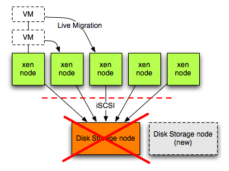
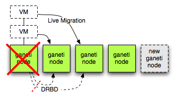

!SLIDE

# Fault Tolerance #

!SLIDE bullets incremental

# Overview #

* Ability to deal with hardware or software outages
* Easily bring service back online with no data loss
* Make services more robust to outages

!SLIDE bullets incremental

# Components of Fault Tolerance #

* Disk Storage (RAID / Clustered storage backends)
* Machine
* Network

!SLIDE center

# Xen Fault Tolerance #

!SLIDE bullets incremental

# Xen fault tolerance #

* Disk nodes had no redundant system
* Lack of adequate management software
* Old hardware
* No easily scalable

!SLIDE center

# Ganeti fault tolerance #

!SLIDE bullets incremental

# Ganeti fault tolerance #

* Each node has storage replicated
* Centralized management software
* Newer hardware
* Very easy to scale
