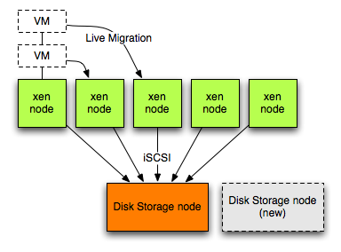
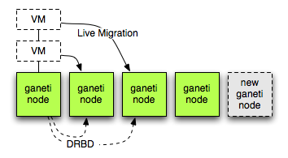

!SLIDE

# Outage Email #

!SLIDE code

From: Lance Albertson
Subject: [Hosting] iSCSI outage (yet again)

We had yet another odd outage with one of our iSCSI hosts
this morning that forced me to reboot all the VMs that were
hosted on it.  Unfortunately I can't find anything in the
logs that explain what happened other than the load spiked
and then everything on the box essentially stopped.

So while I'm at it, I'm going to at least mention what we've
been working on as our solution to this whole mess. We're
planning on ditching the current setup completely (xen +
iscsi) and moving towards a drdb setup using Ganeti [1] and
KVM. How will this make things better?  Well for one, we
won't have a single point of failure anymore with the
storage backend. Also, it should help in disk I/O
performance but we still need to do some testing to confirm
that. It'll also allow us to expand our virtualization
environment with lower costs and cheaper hardware. The other
nice perk is faster deployment.

[1] http://code.google.com/p/ganeti/

!SLIDE code

We currently have a cluster of around 14 IBM blades that act
as the dom0, and two iscsi disk backend servers which those
blades connect to for storage. The new infrastructure will
be a set of 4 or more HP servers using local disks. Granted,
this does pose the problem of having more VMs go down if the
physical machine dies, but at least we can move things
around and the storage backend problem is gone. Currently,
if the disk node goes down (like it did today), we have to
shutdown all the VMs that were on it, and start them all
back up.

We've looked at other solutions, but most required more work
and ganeti seems like the way to go for the type of
environment we have and resources. We could deploy an HA
iscsi setup but that doesn't fix the I/O problems we have,
nor the give us flexibility in the hardware we can use.
Ganeti is still rough around the edges in a few areas, but
overall I think the solution will work great for us. We're
currently working on getting deployment scripts written,
fine tuning how it'll work, and of course testing. I'm
hoping by the end of the year we'll be able to start moving
projects to the new infrastructure. If you'd like to be one
of the early projects to move over and help us test it out,
please let me know. We're still a ways away from that point,
but I'm confident we'll finally get all these silly problems
behind us soon.

I thank you for your patience and I apologize again for
these outages.  We're working as fast as we can to deploy
the new cluster. If you'd like to chat with us more about,
feel free find me in #osuosl (Ramereth). I'm going to be
offline most of today and this weekend, but should be around
all of next week.

!SLIDE bullets incremental

# Overview #

* Series of virtual machine outages
* Sent out email to all hosted projects
* Listed reason for outage
* Also listed new solution

!SLIDE

# Outage section #

    We had yet another odd outage with one of our
    iSCSI hosts this morning that forced me to
    reboot all the VMs that were hosted on it.
    Unfortunately I can't find anything in the
    logs that explain what happened other than
    the load spiked and then everything on the
    box essentially stopped.

!SLIDE bullets incremental

# Explanation #

* Storage backend failed causing the outage
* 35 virtual machines went down
* No information in the system logs

!SLIDE bullets incremental

# Why does this not work well? #

* Single point of failure with disk nodes
* Too many machines per disk node
* No cluster-wide management interface
* Old hardware

!SLIDE center

# Xen Infrastructure #

!SLIDE

# Solution Section #

    So while I'm at it, I'm going to at least
    mention what we've been working on as our
    solution to this whole mess.  We're planning
    on ditching the current setup completely (xen
    + iscsi) and moving towards a drdb setup
    using Ganeti and KVM.  How will this make
    things better?  Well for one, we won't have a
    single point of failure anymore with the
    storage backend. Also, it should help in disk
    I/O performance but we still need to do some
    testing to confirm that.  It'll also allow us
    to expand our virtualization environment with
    lower costs and cheaper hardware. The other
    nice perk is faster deployment.

!SLIDE bullets incremental

# Explanation #

* Storage
* Hypervisor
* Management software
* Hardware

!SLIDE smbullets incremental

# Why does this work better? #

* No single point of failure
* Better distributed storage
* Central management interface
* More flexible & open hypervisor
* Newer & less hardware
* Faster virtual machine deployment

!SLIDE center

# Ganeti Infrastructure #

