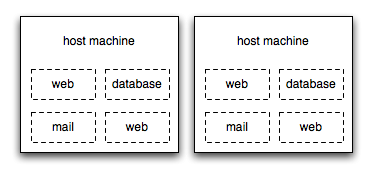
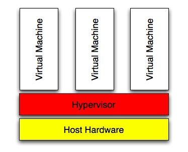

!SLIDE center

# Virtualization Overview#

## Multiple "machines" on one physical machine ##

!SLIDE smbullets incremental

# Benefits of Virtualization #

* More machine utilization
* Less overhead
* Faster & easier to deploy
* Reduces cost (do more with less)
* Tailor usage requirements more efficiently

!SLIDE bullets incremental

# Hypervisor #

* Core component of virtualization
* Software that controls virtual machines
* Emulates a hardware environment

!SLIDE center

# Hypervisor #

!SLIDE smbullets

# VM Technologies #

## Commercial ##
* VMWare
* Hyper-V (Microsoft)

## Free ##
* Xen
* KVM
* VirtualBox

!SLIDE bullets incremental

# How it helps the OSL #

* Host more projects with less resources
* Offer full Operating System 
* Fast deployment
* More redundancy
